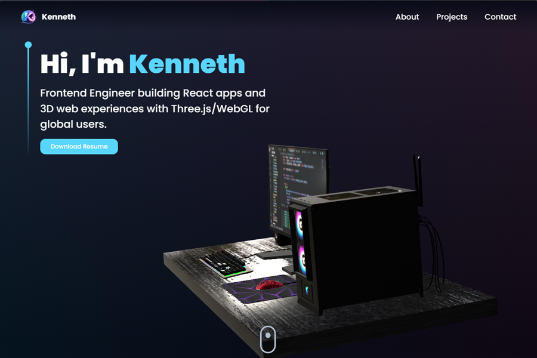

# Kenneth Cudia — Portfolio 3D

[](public/preview.jpg)

A 3D portfolio site built with **React**, **Three.js** / **React Three Fiber**, **Framer Motion**, and **Tailwind CSS**. Showcases projects, experience, and contact with WebGL visuals and smooth animations.

---

## Installation

```bash
npm install
```

## Start dev server

```bash
npm start
```

Runs at [http://localhost:3000](http://localhost:3000).

## Build for production

```bash
npm run build
```

Output is in the `build/` folder.

## Preview production build

```bash
npm run serve
```

## Deploy (e.g. GitHub Pages)

```bash
npm run deploy
```

Uses `gh-pages` to publish the `build/` folder to the `gh-pages` branch. Set `base` in `vite.config.js` to your repo path (e.g. `'/repo-name/'`) when deploying to GitHub Pages.

---

## Features

- **3D / WebGL** — Three.js, React Three Fiber, Drei
- **Animations** — Framer Motion
- **Styles** — Tailwind CSS, SCSS
- **Legacy browsers** — @vitejs/plugin-legacy
- **Contact** — EmailJS form; config via `.env`
- **Resume** — Download link; PDF in `public/`

## Env setup

Copy or create `.env` in the project root with:

- `VITE_APP_EMAILJS_*` — EmailJS keys and recipient
- `VITE_APP_GITHUB_URL` / `VITE_APP_LINKEDIN_URL` — Social links

See `.env.example` or the top of `src/constants/index.js` for defaults.
